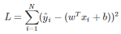
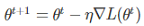
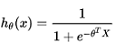
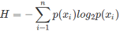
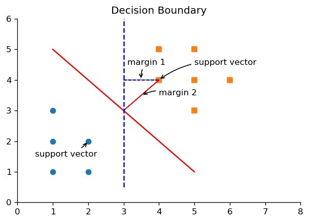
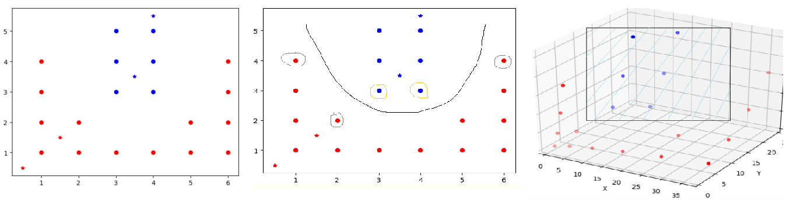
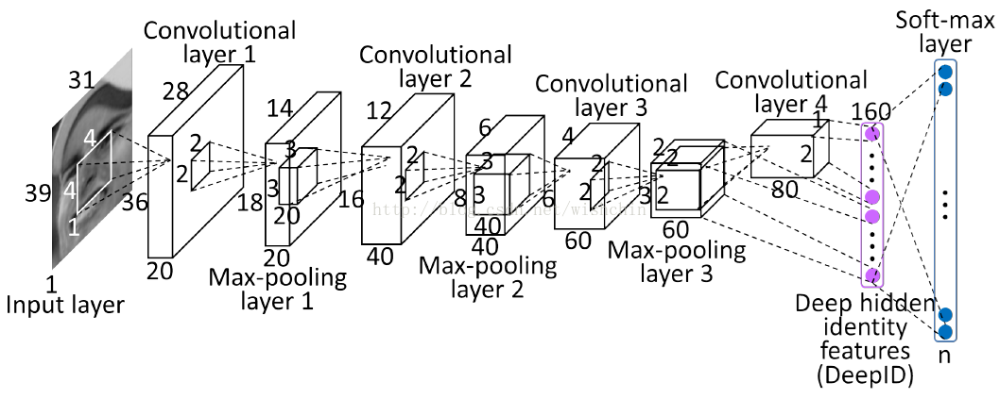
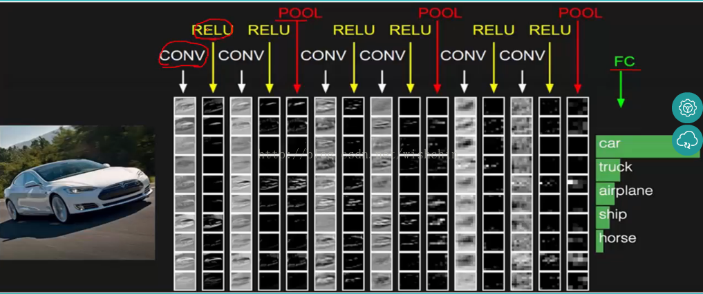

<!--
  Copyright (c) 2018, Xin YUAN, courses of Zhejiang University
  All rights reserved.

  This program is free software; you can redistribute it and/or
  modify it under the terms of the 2-Clause BSD License.

  Author contact information:
    yxxinyuan@zju.edu.cn
-->

# 机器学习

## 前言

机器学习是一门多领域交叉学科，专门研究计算机怎样模拟或实现人类的学习行为，
以获取新的知识或技能，并重新组织已有的知识结构使之不断改善自身的性能，
是人工智能的核心，是使计算机具有智能的根本途径，
其应用遍及人工智能的各个领域[参见[机器学习][BDBK-ML]]。
从广义上来说，它是一种能够赋予机器学习的能力以此让它完成直接编程无法完成的功能的方法，
但从实践的意义上来说，机器学习是一种通过利用数据，训练出模型，然后使用模型预测的一种方法。

## 问题

本章只讨论有监督的机器学习问题，其要解决的问题如下：

1. 回归问题

	回归问题的目标是给定一组n维输入变量x，并且每一个输入的x都有对应的值y，
	我们可以用一条曲线去尽量拟合这些数据点，要求对于这个数据集之外的新输入x'，
	能够预测它对应的连续的目标值t，即返回拟合的曲线上对应的点的值y'从而达到预测的目的。
	要寻找数据和对应连续值之间的关系，实际就是要找到一个函数，能够将数据映射到连续值上。

	回归问题一般通过以下三步解决：
	选择一个模型，模型实际就是函数的集合；
	需要有一个评判标准，能够判断函数的好坏，即loss function(损失函数)，一般它的值越大，
	该函数表现得越差；
	利用上一步中评判标准，在函数集合中找到最好的函数[参见[回归问题][CSDN-RP]]。
	这是一个经典的泛函最优化问题的求解过程。

	以回归问题中最基础的线性回归为例，需要求解的函数可表示为`y=w^Tx+b`，
	其中x和y都是向量，而w和b即为需要求解的两个参数。
	当损失函数为均方误差时，用最小二乘法可以直接计算出w和b的解析解，
	最小二乘法找到的是误差平方和最小的函数：
	，其中yi表示实际值，N则是样本个数。
	另一种常用的方法是梯度下降法，这是一种迭代式的算法，
	它的基本思想，就是对损失函数求参数的梯度，向梯度下降的方向更新参数：
	，
	其中L是损失函数，θ是参数构成的向量，η是learning rate（学习率），
	体现的是每次调整参数调整的大小。

1. 分类问题

	分类问题的本质和回归问题一样，区别在于，输出不再是连续值，而是离散值，
	通过寻找一个函数判断输入数据所属的类别，为其打上一个“标签”，用来指定其属于哪个类别。
	分类问题在现实中的应用也非常广泛，有垃圾邮件识别，手写数字识别等。

	分类问题的求解过程同样可以分为三个步骤：
	确定一个模型`f(x)`，输入样本数据x，输出其类别；
	定义损失函数`L(f)`，一个最简单的想法是计数分类错误的次数；
	找出使损失函数最小的那个最优函数[参见[分类问题][CSDN-CP]]。

	逻辑回归（Logistic Regression）可以看做一种特殊的分类算法，分为正向类（1）和负向类（0），
	因此需要一个输出值在 0 和 1 之间的假设函数：，
	根据设定的参数，输入给定的变量，可以通过此式计算输出变量的值为 1/0 的可能性。
	另一种常见的分类算法是朴素贝叶斯分类，
	通过对给出的待分类项求解各项类别的出现概率大小，来判断此待分类项属于哪个类别，
	通常会选择概率最大的类别，	其实质就是计算条件概率的公式。

1. 决策问题

	决策是一种以示例为基础的归纳学习方法，
	通过每次在各个属性中找到区分度最大的属性来作为当前决策树的节点，
	从而构造出一颗最小体积决策树。
	决策问题中比较重要的就是熵的概念，通常表示事物的混乱程度，熵越大表示混乱程度越大：
	，其中p(xi)为xi为某一取值情况时的概率。

	决策树划分的好坏通过信息增益来计算，
	信息增益就是前后两个熵的差，当差值越大说明按照此划分对于事件的混乱程度减少越有帮助，
	计算各个属性的信息增益，并选择信息增益最大的属性作为当前划分节点。

在数学的形式上，这几个问题是高度相似的，在一定的条件下，其数学模型可以统一表示。
其中，要最优的目标函数，也就是泛函，是需要读者自行分辨其凸性，
从而判断能否得到全局最优解。

## 统计观点

通常首先假设样本空间内存在一批“独立同分布”的样本，服从某个未知分布，
每一条样本都由一组反映事件或对象在某方面的表现或性质的事项组成，也可称作属性-属性值。
样本空间内的每一个点都有其对应的向量表示，
机器学习的任务就是通过这些数据产生“模型”的算法，即“学习算法”（learning algorithm），
当面对“新样本”时，这个“模型”就能根据学习的结果对其进行良好的判断。

可见，机器学习的假设条件是比较严格的，在现实的应用场景下，
获得的训练数据往往并不服从独立同分布假设，同时，模型训练完成后，
输入的新数据若是不符合模型所描述的分布，预测将失败。
因而，在现实非关键应用的工程中，往往把各种可能出现的情形都当作样本加入训练集，
构造尽可能完善的总体样本库来接近独立同分布假设。

## 几何描述

1. 分类问题

    SVM主要可以用来解决有监督的分类问题，
    通过下面这张图可以很好地解释SVM（支持向量机）如何求解分类问题，
    构造一个分割面把不同类别点分开（图中表现为圆形点和方形点），
    这个面称为分割超平面，
    离分割超平面最近的点就是支持向量，
    支持向量到分割超平面距离的两倍即为间距，
    SVM算法的原理就是找到一个分割超平面，它能把数据正确的分类，并且间距最大[参见[svm分类问题][Article-SVM]]。

    

    图1 SVM基本概念，图片来自[svm分类问题][Article-SVM]

    分割超平面一般表示为`w^Tx+b=0`,
    通过一次次的迭代求解不断计算w和b的值，
    当`||w||^2`达到最小时，则认为取得了最优解。
	而这个要求解的最优化函数则是类似抛物面那样的凸函数。

    接下来引入核函数的概念，
	核函数是一个特征转换函数，
    当遇到线性不可分的分类问题时，需要通过对原始数据进行维度变换，
	使其在新的维度线性可分。
	核函数可以看做是不同维度上的一个映射关系，从而避免直接在高维进行运算的不便。
    常用的核函数有线性核函数、多项式核函数、高斯核函数等，
	通过一个简单的实例，可以很好地解释核函数的作用，
	当把线性不可分的问题（最左）通过扩维从二维变到三维后，
	发现其是线性可分的，而在低维空间则可以通过一个类似抛物线的超平面来进行分类。
    事实上，大部分核函数的曲线都是一个类似抛物线的反钟型曲线。

	

	图2 核函数的作用，图片来自[核函数][SVM-K]

1. 深度学习

    深度学习的典型应用是图像分类问题，
	图像分类中常用到的就是CNN（卷积神经网络），
	它的强大之处在于它的多层结构能自动学习特征，不同层在不同尺度上提取图像的特征：
	靠前的层能学习到一些局部区域的精细特征；靠后的层能够学习到粗糙的整体特征。

	CNN主要可以分为以下几个基础层，通过逐层处理得到输出，从而判断图片所属的类别，
	图3、图4很好的表现了CNN在图像分类问题上的求解步骤和各层之间的关系。

	

	图3 CNN图像分类结构，图片来自[CNN层次][CSDN-CNN]

	

	图3 CNN图像分类实例，图片来自[CNN层次][CSDN-CNN]

	卷积层（Convolutional layer）：以扫描窗的方式，对图像做卷积，对每个像素点赋予一个权值，
	可以用来提取局部特征，但是这样处理后，对于一些线性不可分的情况，需要通过引入激活函数来生成特征图，
	加入非线性因素，通过函数把特征保留并映射出来，常用的激活函数有ReLu等。

	池化层（Pooling layer）：通常跟在卷积层之后，它的输入一般来源于上一个卷积层，
	对输入的特征图进行压缩，提取主要特征，同时简化网络计算复杂度，防止过拟合。

	全连接层（Fully Connected layer）：连接所有的特征，将输出值送给分类器，
	它将前面经过多次卷积后高度抽象化的特征进行整合，然后可以进行归一化，
	对各种分类情况都输出一个概率，之后的分类器(Classifier)可以根据全连接得到的概率进行分类。

	归一化层：即Softmax层，如目前图片分类有一百种，那处理后的输出就是一个100维的向量，
	其中的第n个值就是当前图片属于第n类的概率值。

	分类过程中可能会产生过拟合问题，其中一个可能的成因就是使用了过强的模型复杂度，
	参数多，远大于输入数据的维度，并且经过多次训练，训练时，复杂的模型将抽样误差也考虑在内，
	将抽样误差也进行了很好的拟合，这导致模型在训练集上表现良好却在测试集上差强人意。
	从几何直观的角度来说，这就是在拟合高维空间中的曲面，是具有低维子流形性质的结构，
	也就是多个欧氏空间的拼接，可以类比二维空间中的分段函数，所以很容易过拟合。

## 科学哲学观点

本质上，当前有监督的机器学习还是在拟合具有单一假想有因果关系的函数。
而最优化目标函数的设计思想就是设计体现能量最小化的损失函数，
或者假设因变量和自变量具有相关关系时，构造两者的联合概率分布，
通过贝叶斯方法和最大似然法来设计。

## 小结

可见，当机器学习热点方法所基于的理论和技术依然是经典数学的内容，
并没有实质性的进步。

[BDBK-ML]: https://baike.baidu.com/item/%E6%9C%BA%E5%99%A8%E5%AD%A6%E4%B9%A0/217599?fr=aladdin "机器学习"
[CSDN-RP]: https://blog.csdn.net/ivonui/article/details/79263387 "回归问题"
[CSDN-CP]: https://blog.csdn.net/hohaizx/article/details/81835381 "分类问题"
[Article-SVM]: http://ihoge.cn/2018/SVM.html "svm分类问题"
[SVM-K]: https://www.cnblogs.com/xiaotan-code/p/6695049.html "核函数"
[CSDN-CNN]: https://blog.csdn.net/wishchin/article/details/75213289 "CNN层次"
