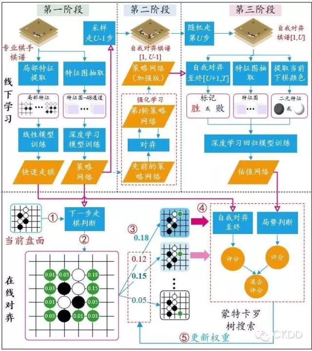

<!--
  Copyright (c) 2017, Xin YUAN, courses of Zhejiang University
  All rights reserved.

  This program is free software; you can redistribute it and/or
  modify it under the terms of the 2-Clause BSD License.

  Author contact information:
    yxxinyuan@zju.edu.cn
-->

# 阿法狗

## 前言

自2015年10月以来，谷歌的围棋机器人阿法狗 (AlphaGo) 大出风头，横扫一众世界顶尖围棋高手。
2017年5月，柯洁再次败于阿法狗。那么，阿法狗真有这么神奇吗？真的是人工智能的重大突破吗？
本文就试图为各位看官揭开它背后的秘密。

## AlphaGo的基本步骤

和双角色棋类游戏一样，人机对战围棋程序也是使用算法(1.1)。但是，围棋程序需要构建的搜索树
规模更大，远远超过中国象棋。围棋棋盘有`19*19`个交叉点，即361个交叉点，因而在人机对战程序
进行第一步或第二步的完整搜索树生成时，需要产生的节点总数为`361*360*...*1`，再去掉少量
无效局面，这还是一个天文数字，远远超过整个宇宙的粒子总数，比象棋的复杂度更高，
所以更不可能在程序中实现了。

还是要引入局面评估函数`y=f(X)`。引入它之后，就可以和象棋程序一样进行剪枝，
从而减少搜索树的大小，在可以接受的时间内求出每一步的下法。
因为棋局盘面的每个交叉点有黑子、白子、无子三种情况，因而局面总数是`3^361`种。这是有限的数字，
所以最直接的实现是做一个数据库，每个局面一一对应着一个评估值。
但是，表示这个自变量的局面总数是天文数字，除去无效的局面，剩下的局面总数也是天文数字，
尽管它远远小于刚才的第一步搜索树的总节点数，但也远远超过整个宇宙的粒子总数了。
所以建立这样的数据库是不可能的，还是需要从自变量本身计算出评估值才有实用价值。

在这里，读者同样可以证明围棋的局面评估函数`y=f(X)`是非线性函数。那么如何得到这个非线性函数呢？
显然，围棋的复杂性远超象棋，不可能和象棋一样通过人工经验的子力评估来获得。
所以谷歌的DeepMind公司直接选择了拟合函数的技术路线。

**函数拟合**，是在给出一系列“ *点* ” (包含有自变量或自变量向量及应变量的值) 的条件下，
用给定形式的函数来表示它们。这样得到的函数要尽可能通过这些已知的点，
如果不能全部经过这些已知点，则函数在这些点上的应变量值和已知的应变量值之间的误差应最小。
对那些不是已知点上的应变量值，则由这个拟合出来的函数来确定。

可见，函数拟合的套路是首先需要给出函数的形式，其次是求解误差最小化的最优化问题。
函数的形式和这些“*点*”在高维空间中形成的“*曲面*”形状有关，很难先验地确定。
因此，谷歌选择使用一般的函数形式。神经网络[参见[基础知识][KXW-20170601]]就是在这种一般的函数形式。

在很多年以前，学术界就已经证明，神经网络可以逼近任意非线性函数[参见[在线教程][ZXJC-2017]]。
深度神经网络则是神经网络的升级版，只是比一般的神经网络拥有更多的层和节点而已，
自然它也是用确定的函数形式来拟合函数的一种方法[参见[神经网络][DL-20151231]]。
因为深度神经网络节点多，层数多，拟合出来的函数误差比一般的神经网络更小，
所以Deepmind公司就采用它作为拟合函数的形式。

要拟合一个函数，先要有一些自变量下的应变量的值。如果一开始什么数据都没有，那就是巧妇难为无米之炊，
什么都拟合不出来的。而围棋的局面变化非常复杂，评价函数很难手工估计，
那要怎么才能得到一些棋局上的评估值呢？于是，蒙特卡洛树形搜索(MCTS)方法出场了。
蒙特卡洛树形搜索就是在图1-1所示的搜索树基础上加入了随机模拟搜索的机制，
即每一层不是得到所有的局面，而是按一定的随机规则得到这层的部分局面，
再继续扩展这棵树[参见[腾讯体育][TXTY-20170110]]。
这么做就不再需要得到完整的搜索树这个不可能完成的任务，从而可以用计算能力强的硬件，加上GPU加速，
在有限的时间内得到一棵不完全的搜索树。
对某一个局面来说，这就是随机走子走到终局再统计各种终局的胜负得到该局面下一步黑子或白子的胜负概率，
作为该局面的评估值。显然，这做法并不是很严谨，
也不符合人类的逻辑思维[参见[腾讯体育][TXTY-20170110]]。
但用这个方法能得到一个评估值，不管误差如何，总算是有个值了。
当凑齐一批这样的评估值的时候，就可以用深度神经网络来拟合局面评估函数用于实际的围棋对战了。

微软亚洲研究院的两位博士制作了一张图，来解释AlphaGo的原理[参见[阿法狗原理][AG-20170530]]，
如图2-1所示：

图2-1 阿法狗原理图，图片来自[阿法狗原理][AG-20170530]

AlphaGo总体上包含离线学习和在线对弈两个过程：

* 离线学习

	分为三个训练阶段：

	1. 利用16万多幅专业棋手对局的棋谱来训练。
		这里的输入是已有棋局，通过MCTS快速走棋至终局，得到一个评分，用于对战时的加权平均。
		另外该输入通过深度学习模型训练，得到一个策略网络。
		这是用一个深度神经网络来拟合一个非线性函数，
		它的输入是棋手局面，输出是棋谱中每个空地的落子概率。这就相当于记录和模拟棋谱中的对战策略，
		用于对战中直接得到下一步的可能走法。
	1. 利用策略网络和增强式学习来得到增强的策略网络。
		上一步得到的策略网络是根据已有人类棋谱得到的，因而并不一定是准确的。
		所以，这里通过自我对弈，也就是通过MCTS算法获得相应的胜率，择其优者获得一批生成的棋谱，
		再根据新的一批下一步的走法，通过解优化问题来修改策略网络的参数，得到增强版的策略网络。
		整个过程是一种强化学习过程[参见[强化学习][QL-20170430]]，
		即根据新的反馈修正函数，和自动控制过程相似。
	1. 学习一个价值网络，用于判断结果的输赢概率。
		利用上一步得到的增强版策略网络，对棋谱进行自我对弈，也就是进行不完全搜索树的搜索，
		直到终局，得到每个终局的胜败标记，通过统计得到胜率作为那个开始局面的评估值。
		这个过程也是一种MCTS。有了评估值，通过深度学习回归模型训练出一个价值网络。
		看官现在明白了吧？这个价值网络就是拟合出来的深度神经网络表示的局面评价函数。

* 在线对弈

	包括以下五个关键步骤： 

	1. 根据当前盘面已经落子的情况提取相应特征；
		这是一种预处理策略，目的是降低数据处理的维度，加快运算速度。
	1. 利用策略网络估计出棋盘其他空地的落子概率；
		这是利用训练第一和第二阶段得到的策略网络来得到下一步的可能走法，即搜索树的第一步。
	1. 根据落子概率来计算此处往下发展的权重；
		这是确定搜索树第一步的走子集合。
	1. 利用价值网络和快速走棋网络分别判断局势；
		这里对权重大的走子局面使用两个函数，一个是快速走棋网络，也就是MCTS下至终局得到一个胜率，
		另一个就是利用拟合好的评价函数，两者的值加权平均，得到一个评分值。
	1. 迭代搜索。
		根据上步的评分值，对搜索树第一步走子集合的权重进行修正，
		再选出权重大的走子局面迭代进行上一步。
		可以设定一定的条件来停止迭代，如两次权重大的走子局面相同，或者指定最大迭代次数。
		最后把权重大的走子作为这一步的走法输出。

了解了AlphaGo原理后，就可明白，阿法狗在工程实施的各个环节上做到了极致和精益求精。
但是，MCTS和价值网络的值都要参考，各占0.5的权重，这其实是一个权宜之计，价值网络会出错，
模拟走子终局也并不可靠，通过混合互相弥补一下，但并不能解决太多问题。
最终棋力还是需要靠MCTS海量模拟试错，模拟到新的关键分支以提升棋力。
这样的海量计算，每步需要的时间相对长，需要的CPU与GPU个数也不少，
谷歌甚至开发了特别的TPU进行深度神经网络并行计算来提高计算速度[参见[腾讯体育][TXTY-20170110]]。

到这里，读者依然会发现同样的问题：这样的评估函数计算得到的是真实的值吗？
它同样无法被测量，不能被实验证实。Deepmind公司的CEO，那位被称为世界上最聪明的100人之一，
哈萨比斯，也没有告诉我们这样的评估函数和真实值之间的误差是多少。
也只有等量子计算机出来后，才可能通过构造完全的搜索树获得真实值。
从科学的角度讲，围棋AI同样也不是科学。

AlphaGo的评估函数肯定存在缺陷，这从阿法狗和李世石对阵的第四局落败就可以看出。
但因为阿法狗搜索过的局面比人类多得多，所以在大多数情况下，它的评估函数要比人类准确一些。
这就使得它看起来很厉害，超过人类智能的样子。
加上谷歌公司的推波助澜，于是深度学习披上人工智能的外衣在学术界、工业界、投资界掀起了热潮，
试图将它在其他各个领域都用起来。
而人文学科如哲学法律等学科则一本正经地探讨起人工智能是否会消灭人类之类的伦理问题来，好不热闹。
相信读者已经明白这些是多么荒诞了。

## AlphaGo Zero

AlphaGo的策略网络是通过已有人类棋谱，以及强化学习得到的。然而已有人类棋谱未必靠谱，
所以训练出的策略网络存在缺陷。2017年10月，谷歌升级了AlphaGo，
推出AlphaGo Zero[参见[阿法狗零][AG0-2017-10-19]]。
它其实就是取消了AlphaGo第一阶段利用人类棋谱进行的训练，直接进行第二阶段自我对弈，
也就是MCTS到终局得到胜率，配合强化学习算法，得到增强版的策略网络。
当然，这样得到的策略网络不会受到人类错误棋谱的影响，在实战中也表现出其准确性高于AlphaGo。

阿法狗零直接使用围棋局面作为输入，不再使用设计好的人工特征，这样就更加纯粹。
同时，它也将策略网络和价值网络进行了合并，变成在一个函数中得到下一步落子概率和评估值。

当然，媒体对阿法狗零又大肆吹捧了一番。

## AlphaZero

就在大家认为AlphaGo Zero到达顶峰时，2017年12月，谷歌再次刷眼球，推出Alpha Zero，
号称最强通用棋类AI，8小时完爆人类棋类游戏[参见[阿法零][A0-2017-12-07]]。
它其实就是把阿法狗零的`MCTS+深度网络+强化学习`推广到了国际象棋和日本将棋，并稍作改进。
这样它除了游戏规则需要知道外，其他一切从零开始，经过短时间的训练就完全碾压人类棋手和其他棋类AI。
当然，媒体也不忘将其炒作成“最强通用棋类AI”。

现在有结论了：谷歌公司的炒作能力世界第一。

[TXTY-20170110]: http://sports.qq.com/a/20170110/014217.htm "腾讯体育"
[KXW-20170601]: http://blog.sciencenet.cn/blog-3330899-1058330.html "基础知识"
[ZXJC-2017]: http://neuralnetworksanddeeplearning.com/ "在线教程"
[DL-20151231]: https://www.cnblogs.com/subconscious/p/5058741.html "神经网络"
[AG-20170530]: http://mp.weixin.qq.com/s/hE87wneKmCQCw-a9DBEDyw "阿法狗原理"
[QL-20170430]: http://blog.csdn.net/trillion_power/article/details/70992333 "强化学习"
[AG0-2017-10-19]: http://sports.sina.com.cn/go/2017-10-19/doc-ifymzqpq2269773.shtml "阿法狗零"
[A0-2017-12-07]: https://mp.weixin.qq.com/s/L7bZMkqyncwEt6D5tK1OdQ "阿法零"
