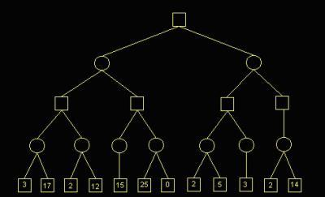

<!--
  Copyright (c) 2017, Xin YUAN, courses of Zhejiang University
  All rights reserved.

  This program is free software; you can redistribute it and/or
  modify it under the terms of the 2-Clause BSD License.

  Author contact information:
    yxxinyuan@zju.edu.cn
-->

# 棋类游戏

## 一般算法

对于双角色的棋类游戏，人机对战的计算机程序算法应该是怎样的呢？

下面以中国象棋为例，来阐述这个过程。先解释一下"棋局"或者"局面"的概念。
所谓"棋局"或者"局面"是指当前双方棋子在棋盘上形成的状态。
如果人类棋手先走第一步，而计算机走第二步，则程序如算法(1.1)所示：

```
1. 针对当前局面，根据规则，分别尝试移动己方各子一步，找出所有有效的下一步棋局。
2. 检查每个可能的下一步棋局，检查是否获胜、失败或者和局。
3. 检查获胜的棋局数，如果为0，则执行第4步，否则针对每个不是获胜、失败或和局的下一步棋局，
再分别尝试移动上一步的对方的各子一步，找出所有有效的下一步棋局。然后继续第2步。
4. 对于己方每个获胜的棋局，回溯到第1步时的所有走法，从中随机选择一种走法，作为算法的结果。
```

算法(1.1) 策略搜索算法

算法中有个和局的检测，这需要根据象棋规则，在循环搜索时为棋局加上合适的标志来判断，很容易实现。

不难看出，上述算法可以用一棵直观的搜索树来表示，如图1-1所示：



图1-1 搜索树，图片来自[腾讯体育][TXTY-20170110]

图中，方块代表人类棋手的棋局，圆圈代表计算机的棋局。它们被称为"节点"。
从上到下每一层就是算法(1.1)中的"下一步"所有有效棋局。
连线代表上层节点按规则走子一步得到下一层的这个节点。
一般地，把上层节点叫做父节点，把连线对应的下层节点叫做子节点。
当节点代表的棋局是获胜、失败、和局时，它不会再有子节点，也被称为叶子节点。
从任意父节点沿着连线到达某个叶子节点就被称为是一条路径。
最顶层的父节点也被称为根节点。而搜索树的最大层数也被称为搜索深度。
当然，在运算过程中，从根节点出发，不是所有路径都会经历所有的层，某些路径在没有达到搜索深度之前就终止了。
并且，每个父节点下的子节点数目也都是不同的。
最后，算法(1.1)的第4步实际上就是检查树的每个获胜叶子结点，沿着连线回溯到根节点，
在根节点下多条路径所经过的第二层子节点中随机选择一个节点的棋局作为运算结果输出。

在计算机根据上面的计算结果下出第二步后，人类棋手下第三步，计算机在下第四步时仍然需要根据算法(1.1)
再次构建图1-1所示的搜索树，得到这一步的算法。当然，这时的搜索树是上一次构建的搜索树的子集，
在工程上可以把上次构建好的树存储起来以避免重复计算。

上述的走棋步骤是不断进行的，直到终局。显然，越到接近终局，搜索树的规模越小，计算速度也越快。

如果要完整地构建出如图1-1所述的搜索树，将是极其庞大的。若每一步平均有45种可行着法，
每局棋平均走100步，那从开始局面展开到分出胜负，则要考虑45的100次方种局面。这一天文数字
要比地球上的原子数目还要多，即使用世界上最快的计算机进行计算，直到地球毁灭也无法算出第二步的
着法[参见[蝴蝶飞的博客][HDF-20150419]]。

可见，构建完整的搜索树在程序实现中几乎没有使用价值。当然，未来如果计算机硬件进步了，出现了
量子计算机，也许能快速构建完整的搜索树，那么这个象棋游戏也就可以寿终正寝了。目前来看这是不现实的。
那么当前可行的方式就是像人类棋手那样有选择地进行搜索，即对搜索树进行必要的裁剪，
取消对无效着法的搜索，这被称为"剪枝"[参见[蝴蝶飞的博客][HDF-20150419]]。

为了实现有效的剪枝，这里需要引入"局面评估函数"的概念。可以将其写成万能的公式：

```
y=f(X)
```

函数f(X)的自变量X表示棋局，它可以用一个向量表示，向量的每个元素是双方棋子在棋盘上的位置；
也可以用张量/矩阵表示，每个元素是棋盘上的交叉点，指出放有何方的何种棋子。
在程序实现时都可以简单地用结构数组表示。当然还可以有其他的表示方式，只要能表示棋局状态就行。
应变量y就是当前局面的评估值，是一个实数，它表明局面的好坏。图1-1中最后一层方块节点中的数字
就是局面的评估值。

显然，这个函数 `y=f(X)` 表明了一种单一的因果关系：原因是当前的棋局X，结果就是局面评估值y。
并且这个函数是非线性的，读者可以自行证明。

有了局面评估函数，就可以对搜索树进行剪枝了。在图1-1所示的每一层，每个节点都可以得到一个评估值，
根据这些值，再配合一些高效的剪枝算法，如Alpha-Beta剪枝算法，可以把该层上局面不好的节点排除掉，
也就是不再扩展这些节点，只留下局面较好的少数节点进行扩展。对于对手的节点，根据MIN-MAX原则，
假设对手能下出最强应对，所以也只要保留对手局面评估最好的那些节点。这样就可以大大缩小搜索树的规模，
对计算存储的要求降低了，同时也加快了运算速度，从而能用有限的计算资源搜索更多的棋步，又不发生漏算
[参见[腾讯体育][TXTY-20170110]]。

在有了评估函数的同时限制最大搜索深度，即不将树扩展到终局，可以进一步减小树的规模，
使得运算平台可以从大型服务器移到人人都有的手机上[参见[腾讯体育][TXTY-20170110]]，
这也就是当前中国象棋人机对战程序得到空前普及的原因。

如果计算机先走第一步，这相当于图1-1的根节点是初始局面，只要在第二层节点中随机选择
一个评估值最好的节点作为着法即可。

可见，评估函数的设计是人机对战计算机程序中最为人性化和模糊化的部分
[参见[蝴蝶飞的博客][HDF-20150419]]。估值函数的准确与否决定着中国象棋AI程序水平的高低。

蒋鹏等写过一本书，书名叫《C/C++中国象棋程序入门与提高》，内容中有局面评估算法。
有兴趣的读者可以根据这本书做出一个实用的人机对战程序。

评估函数的一种实现方式是先给每个棋子一个固定子力评估值，如车是600，炮是285等等，
且红方为正，黑方为负。然后各棋子在棋盘的不同位置上给予一个不同的权值，且区分红黑两方。
还要给棋子的灵活度一个评估值，即各棋子每多一个可走位置就加上一定分值。最后是给予
棋子配合的评估值。综合以上的各个分值得到当前局面的总评估值。而进一步的改进算法包括
"二次估值"和"局势因子的优化"等[参见[蝴蝶飞的博客][HDF-20150419]]。

到这里，读者可能会发现一个问题：这样的评估函数计算得到的是真实的值吗？实际上，
这既无法通过类似FAST这样的大科学装置来测量获得，也无法通过实验设计来获得，
只有等量子计算机出来后，才可能通过构造完全的搜索树获得真实值。从科学的角度讲，它无法证实，
这项人机对战的研究实际上不是科学。

这就是中国象棋这项运动还存在的理由。正因为评估函数得到的可能不是真实值，人类就还有
获胜的可能。当然，经过硬件和算法的提升，目前的人机对战程序搜索广度和深度都超过人类，
水平之高到有时计算机会下出人类无法理解的"AI"棋。这种"AI"棋的背后就是远超人类的庞大搜索树，
而人类总是喜欢拿一条或多条战术意图来分析棋局，自然就无法理解了。
可见，人类棋文化所谓的"棋风"之说是多么矫情。
同时，经过象棋专业人士进行极为专业细致的估值调整，其评估函数水平会越来越高，
象棋AI的水平也会越来越高，因此人类也只有在计算机程序的辅助下才有战胜下棋机器人的机会。
这也就是当前象棋选手普通利用AI软件来训练的原因
[参见[腾讯体育][TXTY-20170110]]。

国际象棋和中国象棋是类似的，所以其人机对战AI程序的算法原理和实现方式也都是类似的，
这里就不再详细阐述。

从上述的分析可以看出，棋类人机对战程序在搜索剪枝等技术上有和人类智能类似的地方，但仅此而已，
它并没有战术意图分析之类人类智能特有的东西，所以棋类AI和人类智能本质上不相类似。
当然，对于棋类游戏来说，其规则是简单而明确的，仅用搜索技术这种机械的、自动化的方法就足够了。

## 多角色游戏

上面阐述的是双角色游戏。对于两个角色都是计算机的情形，每个计算机的策略算法都和前面所述算法类似。
而对于多角色的游戏，如斗地主，桥牌等，每个计算机角色的策略算法也都是和前面所述算法类似的，
读者可以自行实现其算法。

[TXTY-20170110]: http://sports.qq.com/a/20170110/014217.htm "腾讯体育"
[HDF-20150419]: http://www.zgxqds.com/blog/article.asp?id=14324 "蝴蝶飞"
